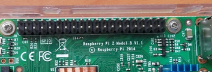
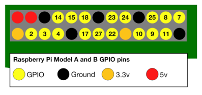

layout: true
.top-line[]

---
class: center, middle

# Raspberry Pi GPIO 
## LED, Button

Junyoung Heo(jyheo@hansung.ac.kr)

Oct. 2017

---
# Raspberry Pi 2/3 GPIO
* GPIO: General Purpose Input/Output

