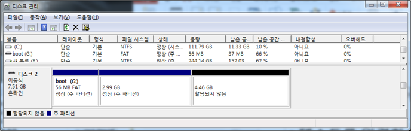
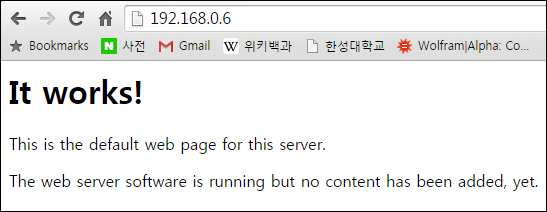

layout: true
.top-line[]

---
class: center, middle

# Beginning Raspberry Pi

Junyoung Heo(jyheo@hansung.ac.kr)

Oct. 2017

---
## Raspberry Pi
* a series of credit card–sized single-board computers
* developed in the UK by the Raspberry Pi Foundation
    - promoting the teaching of basic computer science
* Raspberry Pi 3 Spec.
    - Broadcom BCM2837 SoC
    - CPU: 1.2GHz quad-core ARM Cortex-A53
    - 1GB RAM
    - GPU: 400MHz VideoCore IV
    - 4 USB ports, 40 GPIO pins, HDMI, Ethernet, 3.5mm audio jack, Micro SD slot


---
## Comparison of RPi Series

.footnote[Source: http://hackaday.com/2016/02/28/introducing-the-raspberry-pi-3/]

---
## OSes
* **Raspbian** – based on Debian
* Snappy Ubuntu core
* Ubuntu mate
* Windows 10 IoT core
* OSMC – Open source media center
* OpenELEC
* Risc OS

---
## Installing Raspbian
* Download the Image of raspbian
    - https://www.raspberrypi.org/downloads/raspbian/
* Writing the Image to the SD card (micro SD card)
    - Etcher https://etcher.io/
    

.footnote[https://www.raspberrypi.org/documentation/installation/installing-images/README.md]

---
## Installing Raspbian
* Partition of the SD card

    - boot: files required to boot the raspbian
        + FAT32. So, you can edit a file on Windows
    - Raspbian image
    - Free area: automatically extended to raspbian's root filesystem while first booting
* Insert the SD card to Raspberry Pi 3/zero and turn on

---
## Recommended Tools (for Windows)
* Notepad++ for Editor
    - https://notepad-plus-plus.org/
* Putty.exe for SSH client
    - http://www.chiark.greenend.org.uk/~sgtatham/putty/download.html

---
## WiFi Configuration
* Create a file 'wpa_supplicant.conf' in boot partition of the SD card
	```bash
	country=GB
	ctrl_interface=DIR=/var/run/wpa_supplicant GROUP=netdev
	update_config=1
	network={
	  scan_ssid=1
	  ssid="APname"
	  psk="passwordpassword"
	}
	```
* Insert the SD card to Raspberry Pi 3/zero and turn on
* The file 'wpa_supplicant.conf' will be moved to /etc/wpa_supplicant

---
## Enabling SSH
* Create a file 'ssh' in boot partition of the SD card
* Insert the SD card to Raspberry Pi 3/zero and turn on
* SSH will be enabled and the file will be removed

---
## VNC
* Raspbian contains RealVNC server
* Enable VNC server
    - $ sudo raspi-config
    - enable VNC in interface menu
* VNC Viewer download/install
    - https://www.realvnc.com/en/connect/download/viewer/

---
## Package Upgrade & Installing Web Server
* $ sudo apt update
* $ sudo apt upgrade
* $ sudo apt install apache2

* /var/www/html/index.html
* $ sudo nano /var/www/html/index.html
    - Modify the HTML
